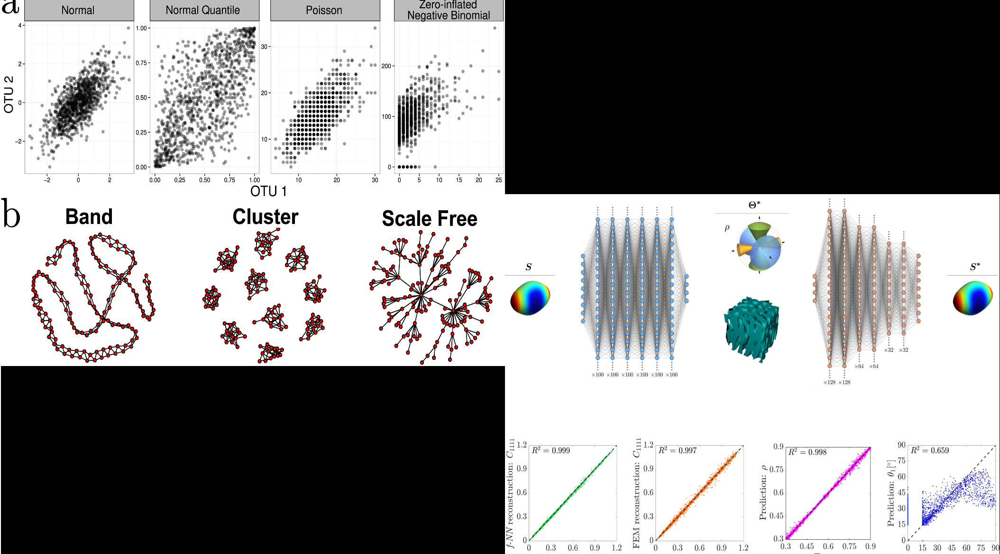

<!-- Main -->

<!-- One -->
<section id="one">
	

		<header class="major">
			<h2>Unveiling my Academic Odyssey</h2>
		</header>
		
A compilation of my finest academic pursuits and innovative undertakings, illustrating my growth as a skilled and dedicated individual. From insightful research endeavors to captivating creations, here's a firsthand glimpse into my unique capabilities and the evolution of my expertise.

	

</section>

<!-- Two -->
<section id="two" class="spotlights">
	<section>
		
		

			

				<header class="major">
					<h3>Master's Thesis: Detecting patterns in 'omics data</h3>
				</header>
				
May 2023 - Present, TU Dresden, Physics of Life - <a href="https://physics-of-life.tu-dresden.de/research/core-groups/doyle">Doyle Lab</a>

				
(Manuscript in progress)

				
<strong>Obejctive:</strong> To identify key proteins in a proteomics dataset using a blend of traditional statistics and advanced Machine Learning on sample data for thorough analysis.

				
<strong>Methodology:</strong> The project employs two data analysis approaches. The classical method involves dimensionality reduction, clustering, and statistical tests to identify changing proteins, with consideration of their biological significance. The advanced approach utilizes Topological Data Analysis to uncover persistent patterns across different scales in the data's topology.

				
<strong>Packages:</strong> pandas, numpy, scipy, seaborn, RIPSER, sklearn, matplotlib, NetworkX

			

		

	</section>
	<section>
		
		

			

				<header class="major">
					<h3>Research Project: Quantitative Modeling of YAP1 Mechanosensitivity</h3>
				</header>
				
November 2021 - March 2022, TU Dresden, Physics of Life - <a href="https://physics-of-life.tu-dresden.de/research/core-groups/doyle">Doyle Lab</a>

				
(Manuscript in progress)

				
<strong>Obejctive:</strong> To develop a quantitative model for protein (YAP) mechano-signaling in response to cellular stimuli across different cell types.

				
<strong>Methodology:</strong> The project utilizes systematic meta-analysis for data collection, non-linear regression for modeling, and an automated ImageJ image analysis pipeline for validation using experimental images from the public domain and lab collaborators.

				
<strong>Packages:</strong> pandas, numpy, scipy, sklearn, matplotlib, ImageJ(FIJI)

			

		

	</section>
	<section>
		
		

			

				<header class="major">
					<h3>Seminar study</h3>
				</header>
				
<strong><a href="https://journals.plos.org/ploscompbiol/article?id=10.1371/journal.pcbi.1004226">Sparse and Compositionally robust inference of Microbial Ecological Networks</a></strong>

				
April 2021 - July 2021, TU Dresden

				
<strong><a href="https://www.nature.com/articles/s41524-020-0341-6">Inverse-designed spinodoid meta-materials</a></strong>

				
April 2021 - July 2021, TU Dresden

			

		

	</section>
</section>

