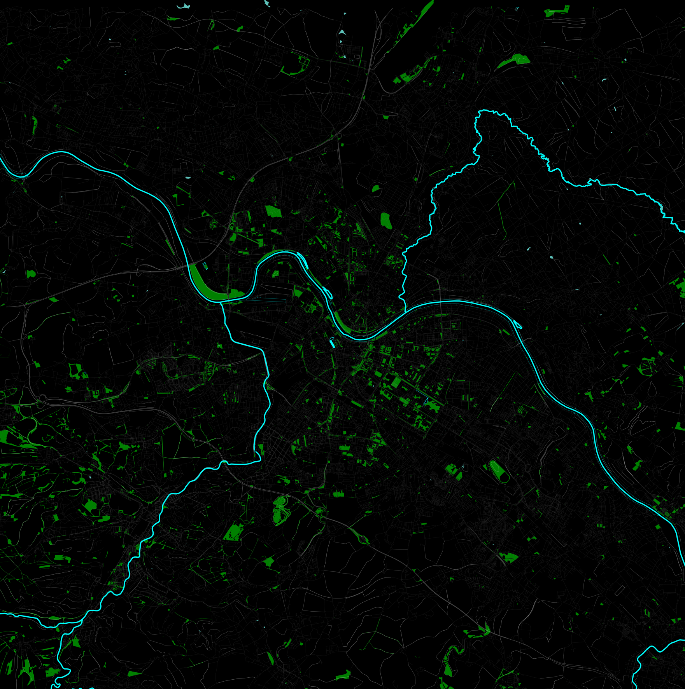
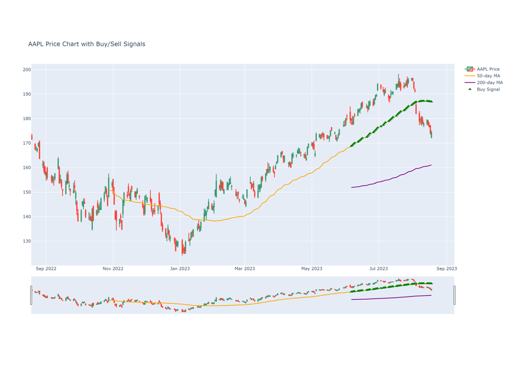

<!-- Main -->

<!-- One -->
<section id="one">
	

		<header class="major">
			<h2>Passion Projects: Coding Adventures in Free Time</h2>
		</header>
		
Diving into the realm of creativity during my leisure hours, I embark on a variety of coding projects that ignite my passion for innovation. From developing interactive web applications to experimenting with data visualizations and algorithmic challenges, these endeavors reflect my constant curiosity and commitment to refining my coding skills.

	

</section>

<!-- Two -->
<section id="two" class="spotlights">
	<section>
		
		

			

				<header class="major">
					<h3>Map Visualizer</h3>
				</header>
				
Crafted for global versatility by leveraging my expertise in <strong>Python-NetworkX</strong> and <strong>Python-OSMNX</strong>, this visually captivating map visualization transforms any set of coordinates into a striking urban landscape. It skillfully highlights city road networks, serene water bodies, and lush green expanses.

				<ul class="actions">
					<li><a href="https://github.com/Purva117/Geo_viz" class="button">To the project</a></li>
				</ul>
			

		

	</section>
	<section>
		
		

			

				<header class="major">
					<h3>Stock Market</h3>
				</header>
				
Experience real-time stock market insights with our dynamic dashboard. Utilizing <strong>Python's PLOTLY-DASH</strong>, this interactive tool not only tracks stock prices but also offers a buy/sell signal feature based on the Golden Cross criteria.

				<ul class="actions">
					<li><a href="https://github.com/Purva117/Stock_market" class="button">To the project</a></li>
					<li><a href="https://purva117.github.io/Stock_market/" class="button">To the App</a></li>
				</ul>
			

		

	</section>
	
</section>

